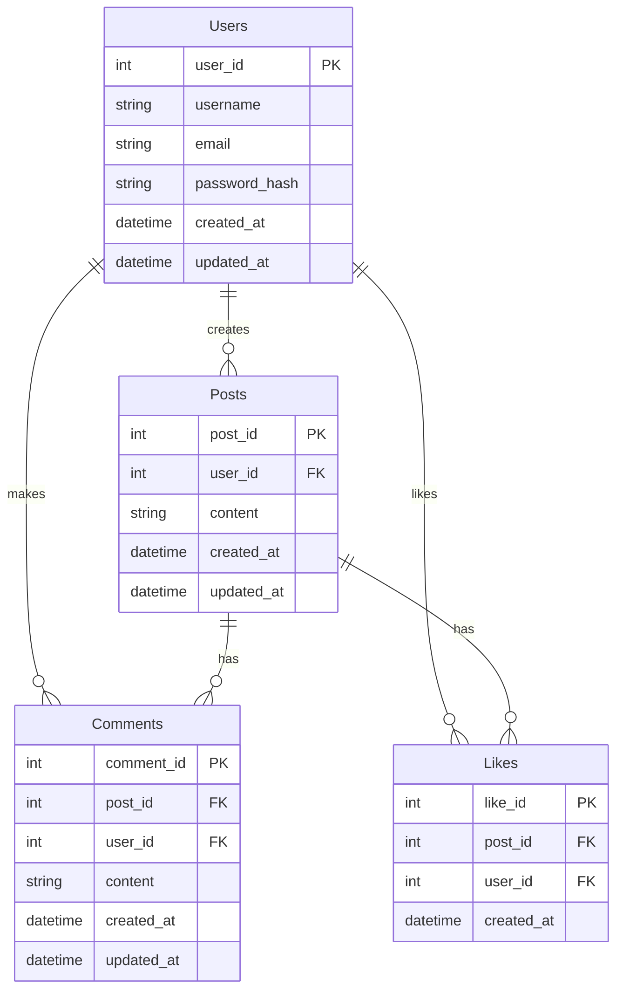

Certainly! Below is the comprehensive documentation for the database schema based on the provided SQL context.

---

# Database Schema Documentation

## Overview
This document provides a detailed description of the database schema, including tables, their purposes, relationships, indexes, data retention policies, common queries, and an Entity-Relationship Diagram (ERD) represented in Mermaid syntax.

## Tables and Their Purposes

### 1. Users
- **Purpose**: Stores information about users of the application.
- **Columns**:
  - `user_id` (Primary Key): Unique identifier for each user.
  - `username`: Unique username for the user.
  - `email`: User's email address.
  - `password_hash`: Hashed password for authentication.
  - `created_at`: Timestamp of when the user was created.
  - `updated_at`: Timestamp of the last update to the user record.

### 2. Posts
- **Purpose**: Contains posts created by users.
- **Columns**:
  - `post_id` (Primary Key): Unique identifier for each post.
  - `user_id` (Foreign Key): Identifier for the user who created the post.
  - `content`: The content of the post.
  - `created_at`: Timestamp of when the post was created.
  - `updated_at`: Timestamp of the last update to the post.

### 3. Comments
- **Purpose**: Stores comments made on posts by users.
- **Columns**:
  - `comment_id` (Primary Key): Unique identifier for each comment.
  - `post_id` (Foreign Key): Identifier for the post the comment belongs to.
  - `user_id` (Foreign Key): Identifier for the user who made the comment.
  - `content`: The content of the comment.
  - `created_at`: Timestamp of when the comment was created.
  - `updated_at`: Timestamp of the last update to the comment.

### 4. Likes
- **Purpose**: Tracks likes on posts by users.
- **Columns**:
  - `like_id` (Primary Key): Unique identifier for each like.
  - `post_id` (Foreign Key): Identifier for the post that was liked.
  - `user_id` (Foreign Key): Identifier for the user who liked the post.
  - `created_at`: Timestamp of when the like was made.

## Relationships
- **Users to Posts**: One-to-Many
  - A user can create multiple posts, but each post is created by one user.
  
- **Posts to Comments**: One-to-Many
  - A post can have multiple comments, but each comment belongs to one post.
  
- **Users to Comments**: One-to-Many
  - A user can make multiple comments, but each comment is made by one user.
  
- **Posts to Likes**: One-to-Many
  - A post can have multiple likes, but each like is associated with one post.
  
- **Users to Likes**: One-to-Many
  - A user can like multiple posts, but each like is made by one user.

## Indexes
- **Users**:
  - Index on `username` for quick lookup.
  - Index on `email` for quick lookup.

- **Posts**:
  - Index on `user_id` for efficient retrieval of posts by user.

- **Comments**:
  - Index on `post_id` for efficient retrieval of comments for a post.
  - Index on `user_id` for efficient retrieval of comments made by a user.

- **Likes**:
  - Index on `post_id` for efficient retrieval of likes for a post.
  - Index on `user_id` for efficient retrieval of likes made by a user.

## Retention Policy
- **Users**: User data is retained indefinitely unless a user requests deletion.
- **Posts**: Posts are retained indefinitely unless deleted by the user.
- **Comments**: Comments are retained indefinitely unless deleted by the user or the post is deleted.
- **Likes**: Likes are retained indefinitely unless the associated post is deleted or the user unlikes the post.

## Common Queries
1. **Retrieve all posts by a user**:
   ```sql
   SELECT * FROM Posts WHERE user_id = ?;
   ```

2. **Get all comments for a specific post**:
   ```sql
   SELECT * FROM Comments WHERE post_id = ?;
   ```

3. **Count likes on a post**:
   ```sql
   SELECT COUNT(*) FROM Likes WHERE post_id = ?;
   ```

4. **Find all users who liked a specific post**:
   ```sql
   SELECT u.* FROM Users u
   JOIN Likes l ON u.user_id = l.user_id
   WHERE l.post_id = ?;
   ```

## Entity-Relationship Diagram (ERD)


---

This documentation serves as a comprehensive guide to understanding the database schema, its structure, and its functionalities.